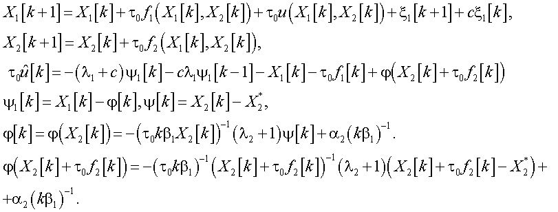

Lotka-Volterra
==============
Исходная модель:

Инструкция по пользованию программой (разработана в MATLAB R2015b).
Для построения графиков нужно программно получить некоторый набор коэффициентов, которые будут использоваться в математической модели системы уравнений Лотки-Вольтерры. Для этого необходимо запустить скрипт valueSerach.m (нажать F5 или кнопку Run).
Полученные в результате перебора значения заносятся в текстовый документ file.txt (если он отсутствует, то он будет создан).
Пользователь выбирает любую комбинацию коэффициентов (любую строку из файла file.txt) и копирует ее.
Далее нужно вызвать в консоли (Command Window) MATLAB функцию showGraphics, передав ей в качестве аргументов скопированные значения.
Пример: 
>> showGraphics(1.000000e-01, 5.000000e-01, 5.000000e-01, 1.000000e-01, 2.000000e-01, 5.000000e-01, 10, 1.000000e-03, 4.000000e-01, 1, 1.000000e-01, 3.000000e-01); 

Будут выведены 2 графика: Размер популяции хищников и жертв как функция от времени в модели Лотки — Вольтерры и Phase Space plot (график Фазовой плоскости).

Примеры построения графиков при различных параметрах модели. 
Функция от времени в модели Лотки — Вольтерры
Phase Space plot (график Фазовой плоскости)

